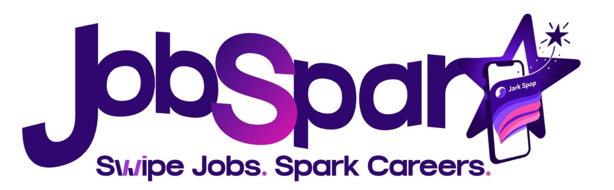
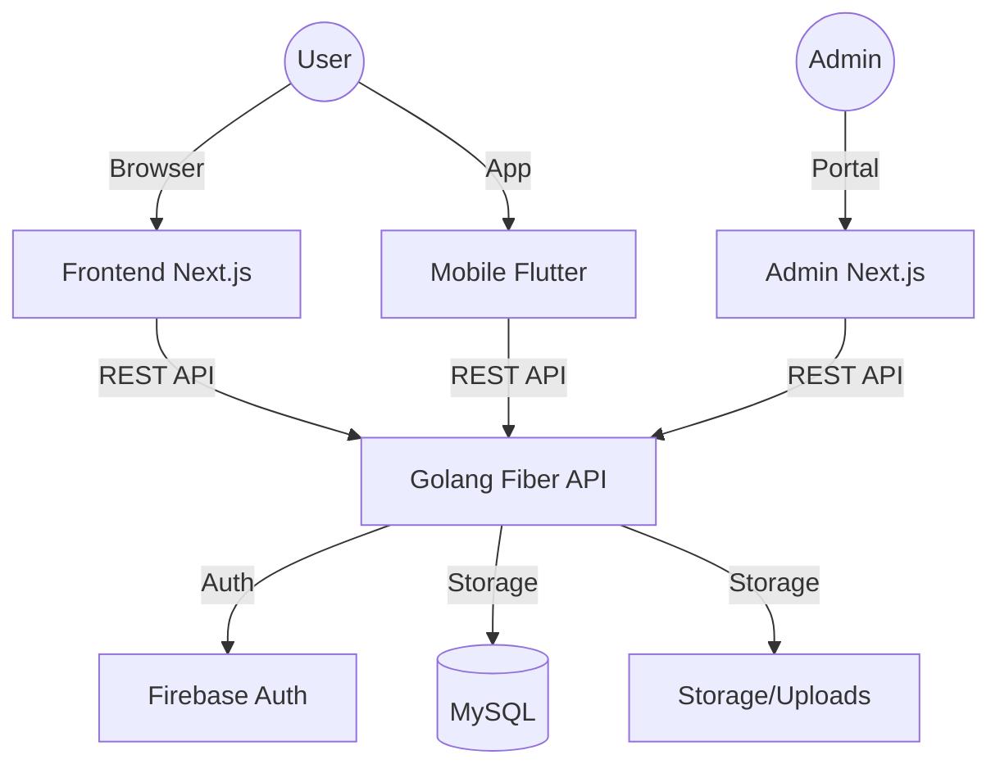

# 

<div align="center">

# ⚡ JobSpark
### **Secure & Scalable Job Matching Ecosystem**
*Bridging the gap between talented students and top-tier companies with security at its core.*

[](https://goreportcard.com/report/github.com/ssarunyu/CP25PL3-JobSpark-Backend)
[](https://nextjs.org/)
[](https://flutter.dev/)
[](https://gofiber.io/)
[](https://firebase.google.com/)

[Architecture](#architecture) • [Features](#key-features) • [Tech Stack](#tech-stack) • [Repositories](#source-code) • [Security](#security--testing)

</div>

---

## 🌟 Overview
**JobSpark** is a comprehensive full-stack platform designed for modern recruitment. It streamlines the connection between **Students** looking for opportunities and **Companies** searching for talent. Built with a focus on **security, scalability, and cross-platform accessibility**, JobSpark provides a seamless experience across Web, Mobile, and Admin interfaces.

---

## 🏗 Architecture
JobSpark follows a **Micro-service inspired Monorepo structure** (managed as separate repositories) to ensure high availability and independent scalability.



---

## 🛠 Tech Stack

#### **Core Infrastructure**
| Layer | Technology | Key Usage |
| :--- | :--- | :--- |
| **Backend** | **Golang (Fiber)** | High-performance RESTful API service. |
| **Database** | **MySQL** | Relational data management for users, jobs, and applications. |
| **Auth** | **Firebase** | OAuth2, OpenID Connect, and Role-Based JWT tokens. |
| **DevOps** | **Docker / GH Actions** | Containerization and Automated CI/CD pipeline. |

#### **Frontend Ecosystem**
| Platform | Technology | Key Usage |
| :--- | :--- | :--- |
| **Web** | **Next.js 15 (TS)** | SSR/ISR enabled platform for students & companies. |
| **Mobile** | **Flutter** | Native performance cross-platform app. |
| **Styling** | **Tailwind CSS** | Modern, responsive, and consistent UI system. |

---

## 🚀 Key Features

### 🎓 For Students
- **Dynamic Profile Management**: Showcase skills, experience, and education.
- **Resume Builder**: Upload and manage multiple professional resumes.
- **Smart Job Search**: Filter jobs by category, location, and salary.
- **One-Tap Application**: Apply to dream jobs instantly and track status.

### 🏢 For Companies
- **Job Posting & Management**: Create, edit, and close job listings.
- **Applicant Tracking System (ATS)**: Review student profiles and manage hiring stages.
- **Company Branding**: Manage company profile and public presence.

### 🛡 Security & Testing
JobSpark implements industry-standard security protocols:
- **Role-Based Access Control (RBAC)**: Strict separation between Student and Company actions.
- **IDOR Protection**: Ensures users can only access their own resources.
- **JWT Authentication**: Secure stateless authentication via Firebase tokens.
- **API Security Matrix**: 130+ security test cases covered using Postman & Newman.

---

## 📦 Source Code

| Component | Repository Link | Focus |
| :--- | :--- | :--- |
| 🛡 **Backend API** | [JobSpark-Backend](https://github.com/ssarunyu/CP25PL3-JobSpark-Backend) | Golang Fiber, Security Core |
| 🌐 **Frontend Web** | [JobSpark-Frontend](https://github.com/ssarunyu/CP25PL3-JobSpark-Frontend) | Next.js 15, User Dashboard |
| 📱 **Mobile App** | [JobSpark-Mobile](https://github.com/ssarunyu/CP25PL3-JobSpark-Mobile) | Flutter, Native Experience |
| ⚙️ **Admin Portal** | [Admin-Portal](./JobSpark-Admin-Portal) | Platform Governance |

---

## 🏁 Getting Started

### 1. Backend Setup
```bash
cd CP25PL3-JobSpark-Backend
make docker-run   # Start MySQL
make run          # Start API Server
```

### 2. Frontend Setup
```bash
cd CP25PL3-JobSpark-Frontend
npm install
npm run dev
```

### 3. Mobile Setup
```bash
cd CP25PL3-JobSpark-Mobile
flutter pub get
flutter run
```

---

## ✍️ Author
**Warisa (Garfair)**  
*Front-end Developer | Full-stack Explorer*  

[](https://github.com/WarisaTT)
[](https://www.linkedin.com/in/warisa-thiamthong/)

---
<div align="center">
    <i>Built with ❤️ as a Capstone Project @ 2026</i>
</div>
